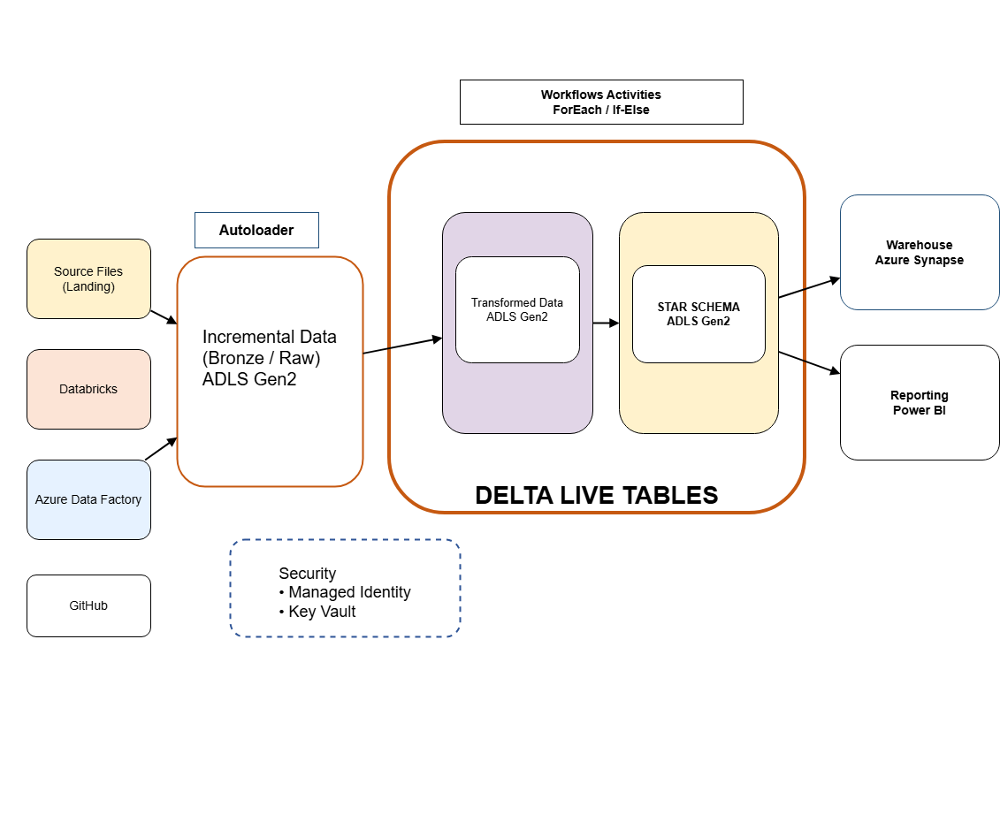

# Azure Data Engineering Project — Autoloader + Delta Live Tables (DLT) + Synapse + Power BI

## 📌 Project Overview
This project demonstrates an end-to-end **Azure Data Engineering pipeline** using modern Databricks architecture:
- Incremental ingestion using **Databricks Autoloader**
- Transformation and orchestration using **Delta Live Tables (DLT)**
- Workflow automation using **Databricks Workflows** (ForEach / If-Else patterns)
- Serving layer modeled as **Star Schema**
- Data published to **Azure Synapse** (Warehouse) and visualized using **Power BI**
- Secure access using **Managed Identity** and optional **Azure Key Vault**

---

## 🏗️ Architecture

---

## 🧰 Tech Stack
- **Azure Data Factory (ADF)** – ingestion/orchestration (optional in this project flow)
- **Azure Data Lake Storage Gen2 (ADLS Gen2)** – storage layers
- **Azure Databricks**
  - **Autoloader** – incremental file ingestion
  - **Delta Live Tables (DLT)** – declarative pipelines for Bronze/Silver/Gold
  - **Workflows/Jobs** – scheduling and orchestration
- **Delta Lake** – ACID transactions and MERGE support
- **Power BI** – reporting layer
- **Security**
  - Managed Identity (preferred)
  - Azure Key Vault (for secrets)

---

## 📂 Data Lake Layers (Medallion)
/raw/ -> Source files (landing zone)
/metastore/ ->  Created Unity Catalog metastore
/bronze/ -> Raw incremental ingested data
/silver/ -> Cleaned & transformed datasets
/gold/ -> Serving layer (Star Schema / curated Delta tables)

